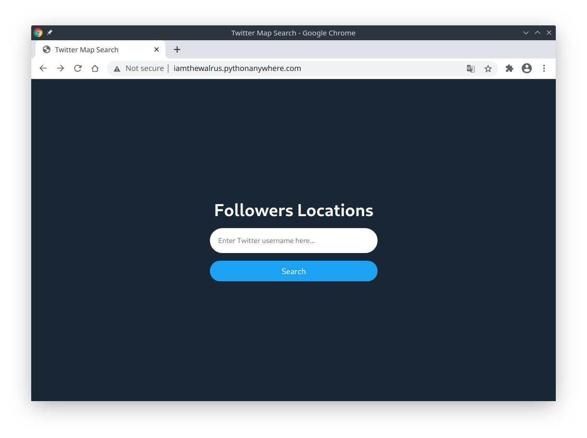
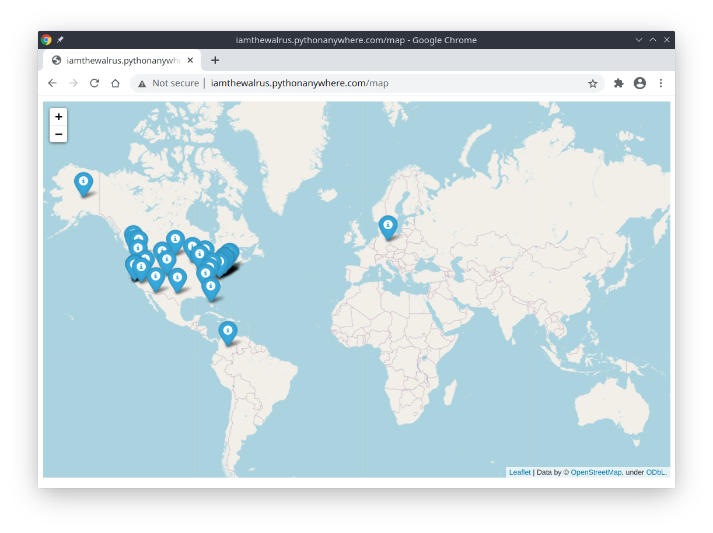

# Twitter Map

## Description
Python website for viewing Twitter followers on the map.

## Usage
Go to this [website](http://iamthewalrus.pythonanywhere.com) and enter a Twitter username of a user you want to see a map of followers for.

If you couldn't access the website, you can host it on your computer.
```bash
$ python application.py
* Serving Flask app "application" (lazy loading)
* Environment: production
  WARNING: This is a development server. Do not use it in a production deployment.
  Use a production WSGI server instead.
* Debug mode: off
* Running on http://127.0.0.1:5000/ (Press CTRL+C to quit)
```
## Result


## License
[MIT](LICENSE)
